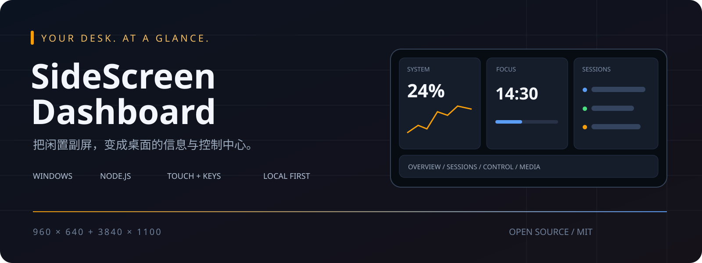
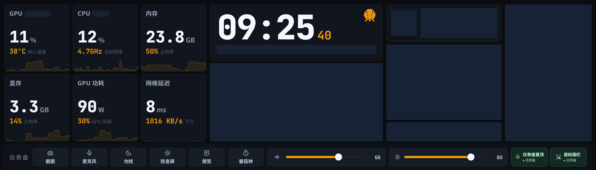
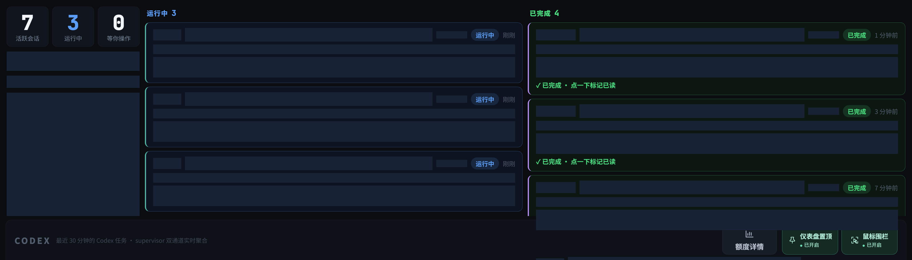
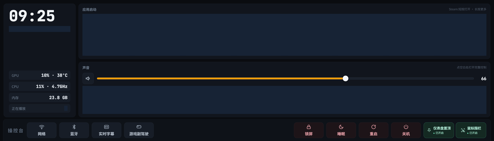

<p align="center"></p>

<p align="center">
  <a href="LICENSE"></a>
  
  
  
</p>

<p align="center"><b>性能、AI 任务、声音和媒体，不必再挤在主屏幕。</b><br>一个为 Windows 小副屏与长条触摸屏打造的本地仪表盘。</p>

<p align="center"><a href="#实机一览">实机一览</a> · <a href="#五分钟启动">五分钟启动</a> · <a href="#按键与触摸操作">按键与触摸操作</a> · <a href="#数据与可选接入">数据与可选接入</a> · <a href="docs/PRIVACY.md">隐私与公开边界</a></p>

## 它能做什么

SideScreen Dashboard 将第二块显示器变成常驻的桌面控制面板：抬眼看 CPU / GPU / 内存与网络，查看 AI 任务是否完成，轻触调节应用音量，或者翻到音乐与歌词页。小屏采用可配置磁贴网格，长条屏采用四页纵向布局。

前端使用原生 HTML / CSS / JavaScript，后端使用 Node.js 内置模块；没有前端打包步骤，也不需要 npm 安装服务端依赖。Windows 音频、媒体、显示器与热键由 PowerShell 和系统 API 提供。**这不是一个纯静态网页**：本机控制能力依赖运行中的 Windows 服务。

| 页面 | 抬眼能看到 | 可以操作 |
| --- | --- | --- |
| **01 · 仪表盘** | 性能磁贴、时钟、Codex 额度、媒体、日程 | 点开磁贴与额度详情、调音量、番茄钟 |
| **00 · AI 任务** | 运行中 / 已完成分栏、等待操作、最后回复 | 点击完成卡标为已读，查看额度 |
| **02 · 操控台** | 应用启动器、系统与应用音量 | 静音、拖动推子、切换输出设备 |
| **03 · 媒体** | 当前曲目、专辑封面、多行滚动歌词 | 播放 / 暂停、上一首 / 下一首 |

主看板首次打开停在 **01**，之后记住当前浏览器的页码。另有 960×640 小屏入口与布局管理台。

## 实机一览

下面是本地正在运行的 `/wide` 页面，使用独立浏览器视口截取。**深蓝色实心区域是不可逆遮盖**：会话内容、设备标识、账号额度、日程、通知、曲目与自定义应用已在生成 PNG 前隐藏。未上传原始截图；封面则是示意图，不代表真实数据。

### 信息总览 · 把主屏还给工作



### 任务视图 · 运行与完成分开看



### 操控台 · 常用操作触手可及



## 五分钟启动

**准备：** Windows 10/11、Node.js 20 或更新的 LTS 版本，以及 Microsoft Edge。原生音频/显示功能主要在 Windows 11 上使用；GPU 专项数据需要 NVIDIA 驱动提供 `nvidia-smi`。宽屏界面以 **3840×1100** 为设计画布，小屏以 **960×640** 为主要尺寸，并非任意分辨率的响应式管理后台。

在 PowerShell 中执行：

```powershell
git clone https://github.com/GeT-LeFt/sidescreen-dashboard.git
cd sidescreen-dashboard
Copy-Item config.example.json config.json
node server.js
```

打开下列地址即可使用。示例配置关闭了鼠标围栏与窗口置顶，方便首次体验。

| 地址 | 用途 |
| --- | --- |
| `http://localhost:3777/` | 小副屏磁贴网格 |
| `http://localhost:3777/wide` | 四页长条屏界面 |
| `http://localhost:3777/admin` | 布局、主题、轮换和数据源配置 |

没有长条屏也能预览：打开浏览器开发者工具，设置视口为 `3840 × 1100` 并缩小预览比例。普通笔记本窗口可能只显示画布的一部分。

**放到实体副屏：** 先在 Windows 显示设置选择“扩展这些显示器”，确认目标屏分辨率正确；随后双击 `start-sidescreen.cmd`。脚本会探测当前屏幕位置，将 Edge kiosk 放到对应分辨率的显示器上；缺少某块屏时跳过它。首次试用可执行 `powershell -NoProfile -ExecutionPolicy Bypass -File .\start-sidescreen.ps1 -SkipScreenGuard`，跳过显示器守护进程。改动摆放位置后运行 `对齐副屏.cmd` 重新对齐。

如果自己的屏幕尺寸不同，需要调整 `public/wide.css` 的画布和布局，以及启动 / 对齐脚本的分辨率匹配。不要直接套用别人的物理坐标。多台同分辨率显示器仍需自行适配识别逻辑。

## 按键与触摸操作

| 输入 | 效果 | 说明 |
| --- | --- | --- |
| **Page Up** | 上一页 | `媒体 → 操控台 → 仪表盘 → AI 任务`；到顶停住 |
| **Page Down** | 下一页 | 按上述逆序向下；到底停住，不循环 |
| **F10** | 小屏翻页 | 示例配置启用；可在管理台调整 |
| 屏幕左右边缘上滑 | 长条屏下一页 | 从边缘热区起手，不是拖动中央磁贴 |
| 屏幕左右边缘下滑 | 长条屏上一页 | 同样到边界停止 |
| 点击性能磁贴 / 额度卡 | 打开详情 | 按 Page Up / Down 可关闭弹层并翻页 |
| 点击已完成的任务卡 | 标记已读 | 本浏览器保存已读记录 |
| 点击静音 / 拖动音量条 | 静音 / 调整音量 | 应用推子与系统主音量分别控制 |
| 点击底部“仪表盘置顶” | 切换置顶 | 需要临时操作屏幕后面的窗口时关闭 |
| 点击底部“鼠标围栏” | 开关鼠标限制 | 鼠标到不了副屏时可用触摸关闭 |

Page Up / Down 使用全局热键，无需副屏窗口焦点；这也会占用其他应用的同名按键。想交还按键，在 `config.json` 中设置 `"wideHotkey": { "enabled": false }` 后重启服务。浏览器获得焦点时仍有本地键盘翻页。游戏副驾驶模式中翻页被禁用。

## 数据与可选接入

基础性能与时钟可独立使用。其余模块按需配置；没有数据源时显示占位状态，不代表启动失败。

| 模块 | 来源 / 配置 | 边界 |
| --- | --- | --- |
| CPU、内存、网络 | Node.js 与本机系统采集 | 温度等专项数据依赖驱动 |
| GPU | `nvidia-smi` | 非 NVIDIA 设备不保证提供同等指标 |
| Codex 用量 | `codex-usage.js` 调用本机 Codex App Server | 需已安装并登录 Codex；客户端自行处理认证，项目不读取认证文件 |
| AI 任务聚合 | 本地活动文件；可选 supervisor `3778` | 跨设备实时同步需要额外的发布端 / 中继，并未打包成一键云服务 |
| 播放信息与封面 | Windows SMTC | 播放器需暴露媒体会话；播放队列可能不可用 |
| 歌词 | 在线歌词查询 | 需要网络，匹配与时序取决于来源，不保证每首命中 |
| 日历 / 天气 | `calendar.icsUrl` / 管理台天气配置 | 订阅 URL 与定位只放在本机配置 |
| 声音 | Windows Core Audio；按应用路由使用 SoundVolumeView | 设备显示可用 `audio.favorites` 过滤 |
| 游戏 FPS | 可选 PresentMon | 权限和驱动不满足时可能无数据 |

Codex 查询代码目前保留了本地代理 `127.0.0.1:7897` 的历史回退。你的代理地址不同或不使用代理时，请检查 `codex-usage.js` 的 `appServerEnv()`，按环境调整，避免把网络问题误认为账号额度为空。

## 项目结构

```text
server.js                 本地 HTTP 服务、配置与系统采集
codex-usage.js            Codex 额度查询
public/
  index.html             小屏磁贴入口
  wide.html / css / js    四页宽屏界面
  admin.html             布局与配置管理
  screen-controls.*      置顶 / 鼠标围栏开关
start-sidescreen.*        启动与 kiosk 定位
align-screen.ps1          重新定位窗口
wide-hotkey-listener.ps1  Page Up / Page Down 全局热键
audio-agent.ps1           音量与音频设备
nowplaying.ps1            Windows 媒体会话
config.example.json      可公开的启动示例
docs/                    截图与发布隐私说明
```

## 公开与隐私

`config.json`、用量历史、日志、会话缓存、凭据、截图草稿及备份均不应提交；示例配置中没有个人设备 ID、日历订阅或服务器凭据。运行时仍可能在本地生成日志和历史文件，请自行管理备份。

**不要把 3777 直接暴露到公网。** 当前服务包含应用启动、声音和电源控制等本机操作接口，并非带账号鉴权的多租户服务。请在可信本机环境使用，必要时用 Windows 防火墙限制局域网访问。将 README 展示在 GitHub 并不需要开放这个端口。

更多发布边界、截图规则和历史说明见 [PRIVACY.md](docs/PRIVACY.md)。欢迎围绕显示器识别、不同分辨率布局和可移植的数据源提交改进。

## License

项目代码采用 [MIT](LICENSE)。仓库中已有的第三方工具、动画和字体仍遵循各自许可；项目 MIT 许可不重新授权这些素材。PresentMon、SoundVolumeView 等可选组件的下载与再分发请遵守上游条款。
